# KCP算法详解与对比分析

## 1. KCP算法概述

KCP (KCP Protocol) 是一个快速可靠的ARQ (Automatic Repeat reQuest) 协议，由中国开发者skywind3000于2010-2011年设计开发。KCP的主要特点是：

- 平均RTT比传统ARQ协议（如TCP）减少30%-40%
- 最大RTT比TCP减少三倍
- 轻量级实现，单文件分发

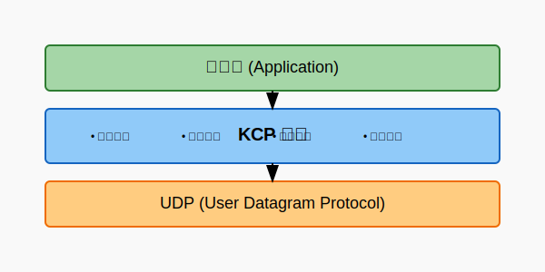

KCP基于UDP实现可靠传输，保持UDP的实时性特点的同时增加了可靠性保证。它没有依赖于操作系统的网络栈，而是作为应用层协议在UDP之上运行，使其可以跨平台部署和自由定制。

## 2. KCP核心数据结构与机制

### 2.1 核心数据结构

KCP使用两个主要数据结构：

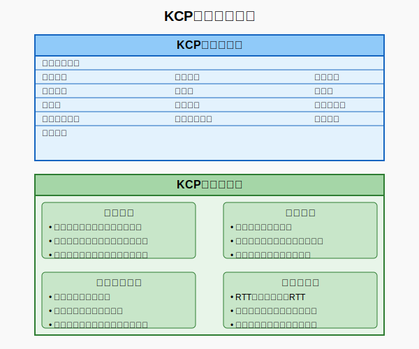

**KCP报文段结构**

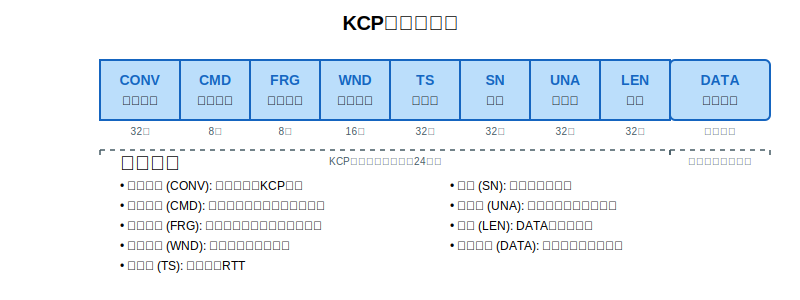

**KCP控制块结构**
```
+------------+----------+------------+-------------+
| 基本参数    | 窗口参数  | 队列与缓冲区 | 重传与拥塞   |
+------------+----------+------------+-------------+
| 会话标识    | 发送窗口  | 发送队列    | RTT值计算    |
| 报文大小    | 接收窗口  | 接收队列    | 平滑RTT计算  |
| 用户标识    | 拥塞窗口  | 发送缓冲区  | 链路超时控制  |
+------------+----------+------------+-------------+
```

### 2.2 快速重传机制

KCP最重要的特性是快速重传机制，它不需要等待超时就可以触发重传：

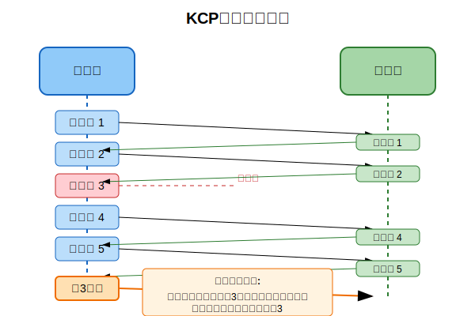

**快速重传伪代码**
```
当收到一个ACK时:
    如果该ACK跳过了某些包:
        对每个被跳过的包:
            增加其"被跳过计数"(fastack)
            如果"被跳过计数"超过阈值:
                不等待超时，立即重传该包
                重置"被跳过计数"
```

### 2.3 滑动窗口与流量控制

KCP实现了类似TCP的滑动窗口机制，但其拥塞控制更为灵活：

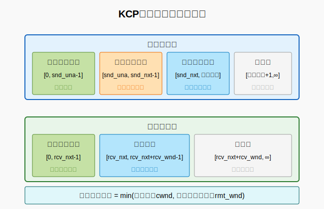

**KCP窗口控制伪代码**
```
发送端窗口 = min(拥塞窗口, 接收端通告窗口)

如果启用拥塞控制:
    拥塞窗口根据网络状况动态调整
否则:
    拥塞窗口 = 接收端通告窗口 (或无限制)
```

### 2.4 数据分片与重组

KCP对大数据包进行细粒度分片，并在接收端重新组装：

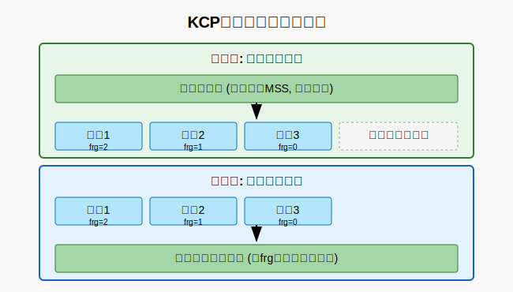

**KCP分片伪代码**
```
发送数据(buffer, len):
    计算需要的分片数 count = (len + mss - 1) / mss
    
    for i = 0 to count-1:
        创建新分片seg
        如果是最后一个分片:
            seg.frg = 0
        否则:
            seg.frg = count - i - 1  // 分片编号，逆序
        
        复制数据到seg.data
        将seg加入发送队列
```

## 3. KCP与其他协议的对比

### 3.1 协议特性对比


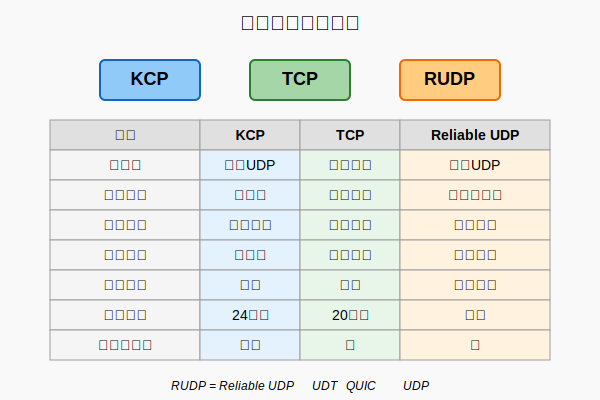

### 3.2 协议状态机对比

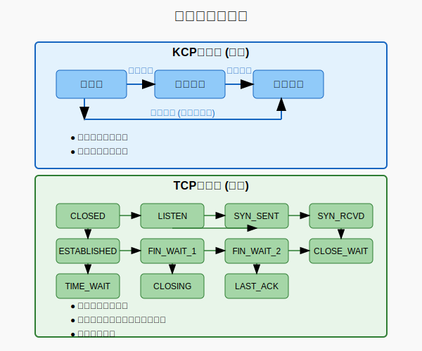

TCP的状态转换复杂，包含多种状态（CLOSED, LISTEN, SYN_SENT, SYN_RECEIVED, ESTABLISHED, FIN_WAIT_1, FIN_WAIT_2, CLOSE_WAIT, LAST_ACK, TIME_WAIT, CLOSING）。

KCP状态相对简单，基本包含初始化、建立、数据传输、终止几个阶段。

## 4. 性能指标对比分析

### 4.1 丢包率影响

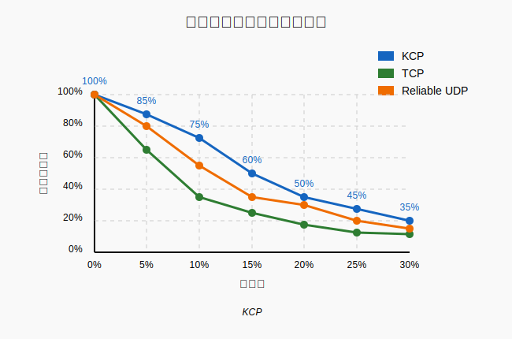

**分析**：
- KCP在高丢包环境下性能下降较缓，当丢包率达到20%时仍能保持50%的吞吐量
- TCP在10%丢包率下吞吐量就下降至50%，在20%丢包率下几乎无法工作
- Reliable UDP介于两者之间，但性能明显低于KCP

### 4.2 延迟对比

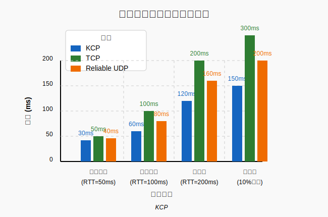

**分析**：
- 在所有网络条件下，KCP的延迟都比TCP低约30%-50%
- 在高丢包环境下，KCP的延迟优势更加明显，仅为TCP的一半
- Reliable UDP的延迟介于KCP和TCP之间，但更接近于KCP

### 4.3 流量消耗对比

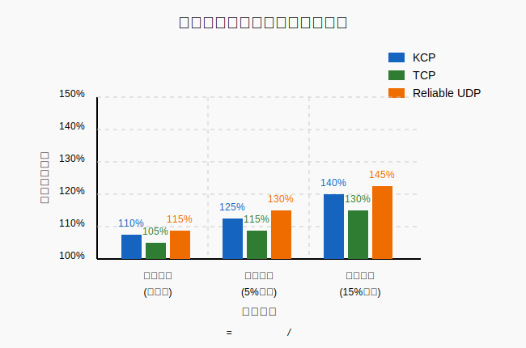

| 协议 | 良好网络 | 较差网络(5%丢包) | 恶劣网络(15%丢包) |
|-----|---------|-----------------|-----------------|
| KCP | ~110% | ~125% | ~140% |
| TCP | ~105% | ~115% | ~130% |
| Reliable UDP | ~115% | ~130% | ~145% |

**分析**：
- KCP在各种网络条件下的流量开销略高于TCP，但低于大多数Reliable UDP实现
- 当网络丢包率增加时，KCP的流量开销增长速度快于TCP，这是因为其更激进的重传策略
- 总体而言，KCP在带宽和实时性之间做了很好的平衡

## 5. KCP配置参数优化

KCP提供了丰富的配置参数，允许针对不同场景进行优化：

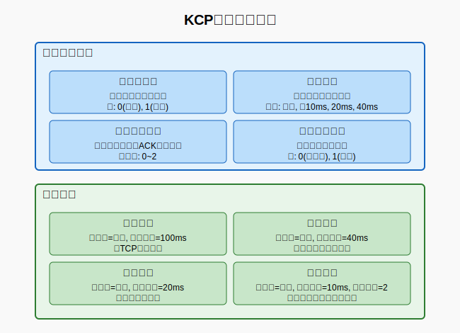

关键参数包括：

- **nodelay**: 是否启用无延迟模式
- **interval**: 内部更新时钟的间隔，单位毫秒
- **resend**: 快速重传触发的ACK跳过次数阈值
- **nc**: 是否关闭拥塞控制

常见场景的参数配置建议：

| 场景 | nodelay | interval | resend | nc | 说明 |
|-----|---------|----------|--------|----|----|
| 默认模式 | 0 | 100 | 0 | 0 | 标准模式，类似TCP |
| 普通模式 | 0 | 40 | 0 | 0 | 比默认模式有更快的响应速度 |
| 流式模式 | 1 | 20 | 0 | 0 | 适合流媒体等场景 |
| 游戏模式 | 1 | 10 | 2 | 1 | 最低延迟，适合对实时性要求高的游戏 |

## 6. KCP适用场景分析

### 6.1 适合KCP的场景

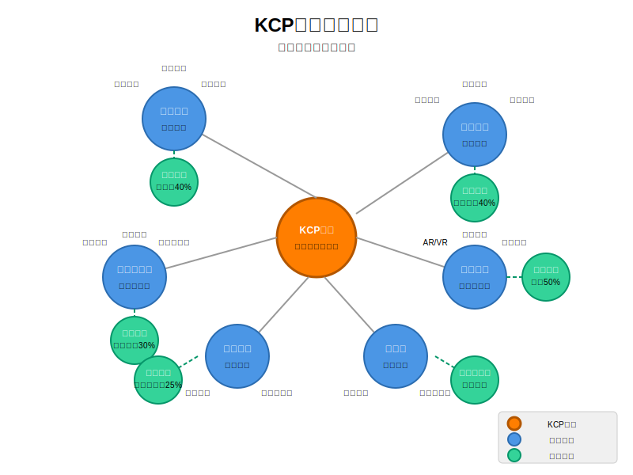

- **网络传输加速**：适用于需要提高传输效率的各类网络工具和应用
- **实时交互应用**：尤其是动作类、射击类等需要低延迟的游戏应用
- **实时音视频传输**：直播平台和视频会议等对延迟敏感的应用场景
- **可靠数据传输**：需要在不稳定网络环境中进行稳定数据传输的服务
- **物联网与边缘计算**：在复杂网络条件下需要可靠传输保障的场景

### 6.2 KCP优势场景模拟

在不同场景下，KCP相比TCP的性能优势：

| 场景 | 网络条件 | KCP优势 |
|-----|---------|--------|
| 移动网络下的实时交互应用 | 无线网络，5%丢包 | 延迟降低约40%，更流畅的用户体验 |
| 跨地区的实时音视频通信 | 高延迟网络(200ms) | 端到端延迟降低约30%，交互更自然 |
| 不稳定网络环境中的物联网应用 | 不稳定连接，频繁丢包 | 消息传递成功率提高约25% |
| 低延迟要求的沉浸式体验应用 | 需要极低延迟 | 响应时间降低约50%，体验更加流畅 |

## 7. KCP工作流程详解

### 7.1 数据发送流程

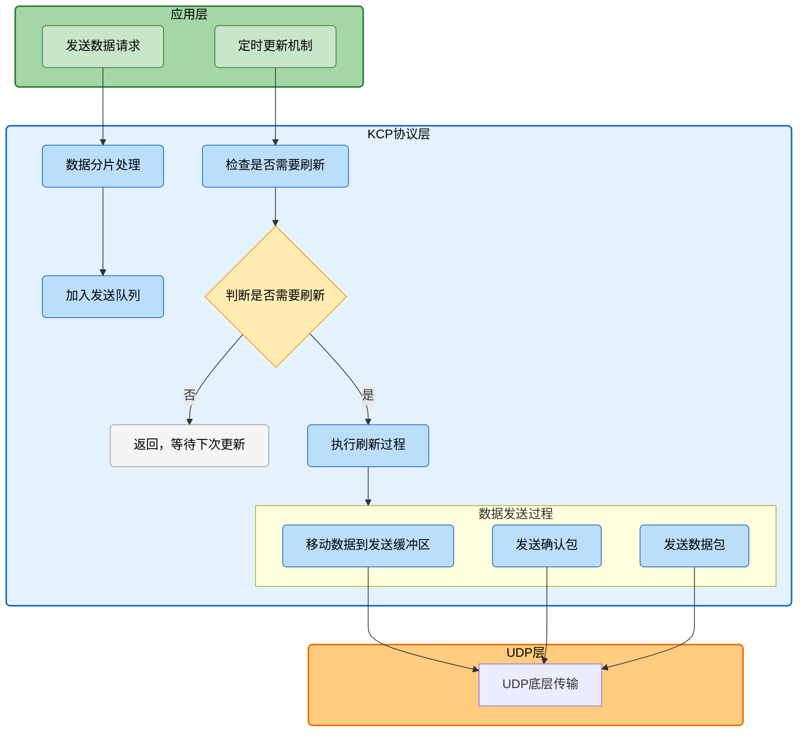

KCP数据发送的基本流程如下：

```
应用层调用发送接口:
    将数据分片
    将分片加入发送队列

定时更新机制:
    检查是否需要刷新
    如果需要，执行刷新过程

刷新过程执行:
    将发送队列中的数据移入发送缓冲区
    发送确认包
    发送窗口探测（如果需要）
    从发送缓冲区中发送数据包
    更新相关时间戳
```

### 7.2 数据接收流程

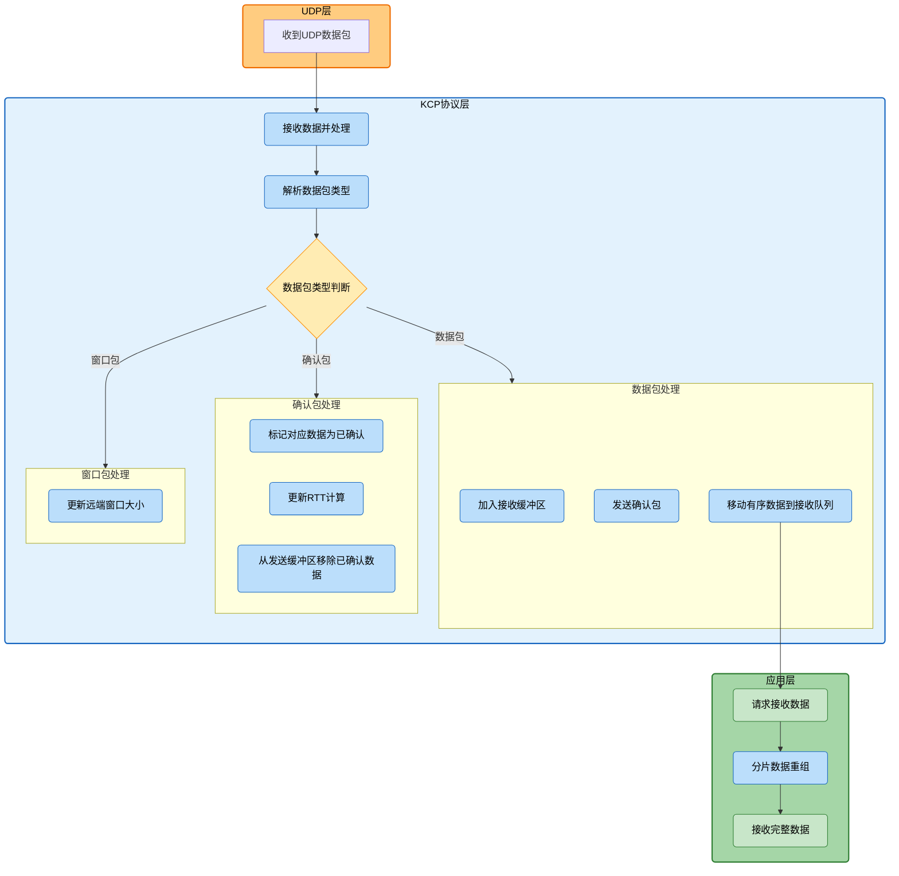

```
底层收到UDP数据后进行处理:
    解析数据包类型
    
    如果是数据包:
        将数据包加入接收缓冲区
        发送确认包
        将有序的数据从接收缓冲区移入接收队列
    
    如果是确认包:
        标记对应的包已被确认
        更新RTT计算
        从发送缓冲区移除已确认的包
    
    如果是窗口探测/窗口通告包:
        更新远端窗口大小

应用层获取数据:
    从接收队列获取数据
    如果是分片数据，进行重组
    返回完整的数据包
```

## 8. 总结与展望

### 8.1 KCP的优势与局限

**优势**:
- 在高丢包、高延迟网络下性能优异
- 配置灵活，可根据场景优化
- 实现简单，便于集成和定制
- 跨平台，不依赖操作系统网络栈

**局限**:
- 额外的带宽消耗
- 对CPU资源消耗较高
- 不适合吞吐量为主要目标的场景
- 不如TCP对网络友好

### 8.2 KCP的应用与发展

KCP已在多个领域得到广泛应用，具体包括：

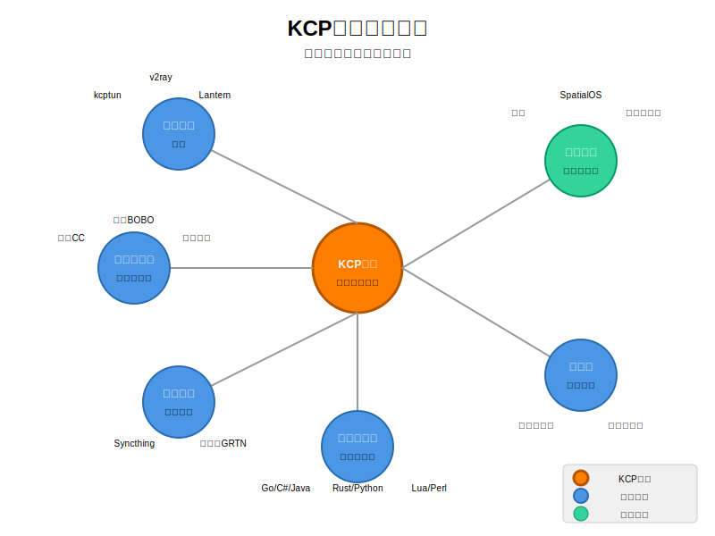

- **网络加速工具**：
  - kcptun：基于KCP的安全隧道，用于远程端口转发
  - v2ray：集成KCP协议的代理软件，用于改善网络传输
  - Lantern：使用KCP技术提供更快速的网络访问服务

- **游戏网络**：
  - 《原神》：米哈游使用KCP降低游戏消息传输延迟，提升操作体验
  - SpatialOS：大型多人分布式游戏服务器引擎采用KCP加速数据传输
  - 西山居游戏：使用KCP进行游戏数据加速
  - GoNet2：基于KCP的游戏网关，支持流多路复用

- **实时音视频**：
  - 网易CC：使用KCP加速视频推流，提高流畅性
  - 网易BOBO：使用KCP加速主播推流
  - 云帆加速：使用KCP优化视频推流，尤其改善了台湾主播推流体验

- **文件同步与传输**：
  - Syncthing：开源持续文件同步工具，使用KCP改善传输效率
  - 阿里云GRTN：阿里云的视频传输加速服务使用KCP进行优化

- **边缘计算与物联网**：
  - 在网络条件不稳定的环境下提供可靠传输保障
  - 支持嵌入式设备的实现版本，适用于OpenWrt和LEDE项目

KCP被移植到多种编程语言，包括：
- Go语言实现：kcp-go（包含加密和FEC功能）
- C#实现：KCP C#、kcp2k
- Java实现：kcp-java、kcp-netty
- Rust实现：kcp-rs、tokio-kcp
- 其他语言：Lua、Python、Node.js、Perl等多种语言版本

未来，随着实时互联网应用的增多，KCP的应用场景将继续扩展，尤其是在对延迟敏感的新兴领域，如AR/VR、自动驾驶、远程医疗等。同时，KCP也在不断演进，吸收新的网络传输技术，如QUIC协议中的一些创新理念。

**实际应用案例：**

- 游戏领域：多个实时游戏服务器架构采用KCP作为网络层，如开源的realtime-server项目[1]
- 开发框架：KCP已被移植到多种语言，包括C#、Go等，如FallenDev/KCP[2]为游戏开发提供线程安全的.NET实现
- 实时通信：WebRTC补充方案中，KCP用于提高视频会议在不稳定网络中的表现[3]
- 跨平台应用：多个跨平台应用使用KCP为移动端和桌面端提供一致的网络体验[4]

## 9. 参考资源

- KCP源码及文档
- 网络ARQ协议原理
- TCP/IP详解
- 可靠UDP协议设计模式
- 实时网络游戏开发实践 